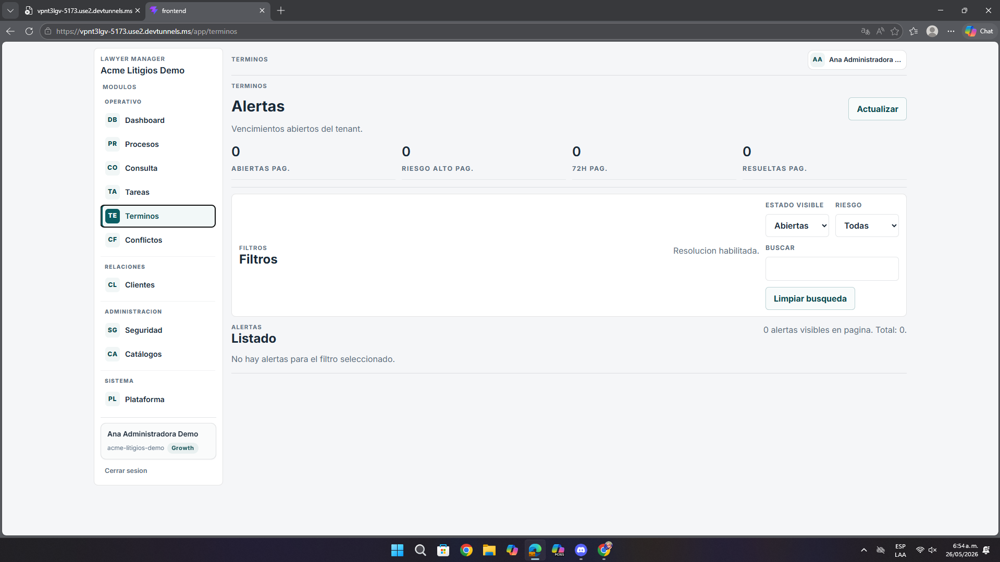

# Análisis de Pantalla – Términos / Alertas

**Fecha:** 26 de mayo de 2026  
**Contexto:** Revisión de UI/UX, filtros y claridad del módulo  
**URL analizada:** `https://vpnt3lgv-5173.use2.devtunnels.ms/app/terminos`  
**Archivo asociado:** `pantalla5.png`

---

## Resumen ejecutivo

El módulo comunica que se trata de alertas y vencimientos, pero la forma en que presenta métricas, filtros y estados no ayuda lo suficiente a que el usuario entienda rápido qué pasa y qué debería revisar primero.

- Hay abreviaturas difíciles de interpretar.
- Los filtros no explican bien su alcance.
- El estado de la pantalla resulta poco expresivo.

---

## 1. Problemas detectados

| Observación | Impacto |
|-------------|---------|
| Las métricas usan copy abreviado | El usuario no entiende rápido qué significan |
| Algunos filtros no explican su función | Baja confianza al operar |
| El botón de limpiar no deja claro si reinicia todo | Duda sobre el estado real de la vista |

---

## 2. Recomendaciones

- Cambiar abreviaturas por etiquetas completas.
- Añadir ayuda breve en filtros poco obvios.
- Confirmar visualmente cuándo la limpieza sí se ejecutó.

---

## 3. Lectura desde la experiencia del usuario

La principal dificultad no está en encontrar el módulo, sino en interpretar lo que la pantalla intenta comunicar. El usuario ve cifras, filtros y estados, pero no siempre entiende cuál alerta merece atención o si la vista ya quedó correctamente actualizada.

---

## 4. Priorización

| Prioridad | Tipo | Acción |
|-----------|------|--------|
| **Media** | Copy | Aclarar etiquetas y métricas |
| **Media** | UX | Hacer más transparentes los filtros |
| **Baja** | Feedback | Confirmar limpieza y actualización |

---

## Anexo – Evidencia visual

