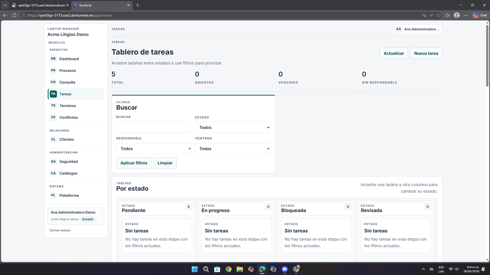

# Análisis de Pantalla – Tablero de Tareas

**Fecha:** 26 de mayo de 2026  
**Contexto:** Revisión de UI/UX, filtros y productividad  
**URL analizada:** `https://vpnt3lgv-5173.use2.devtunnels.ms/app/tareas`  
**Archivo asociado:** `pantalla4.png`

---

## Resumen ejecutivo

La pantalla deja ver con claridad la intención del tablero, pero todavía no transmite de forma suficientemente evidente cómo debe usarse ni qué esperar de sus filtros y estados.

- La funcionalidad drag-and-drop no se descubre fácilmente.
- Los filtros ocupan demasiado espacio.
- Los campos de fecha y el feedback de actualización generan dudas.

---

## 1. Problemas detectados

| Observación | Impacto |
|-------------|---------|
| Las columnas parecen estáticas | El usuario no percibe rápido que puede mover tareas |
| El bloque de filtros crece demasiado | En pantallas pequeñas obliga a hacer más scroll |
| Los placeholders de fecha son poco claros | Aumentan errores al diligenciar |
| No hay suficiente señal visual al aplicar filtros | El usuario no sabe si hubo actualización |

---

## 2. Recomendaciones

- Marcar mejor la interacción de arrastrar y soltar.
- Colapsar o simplificar filtros en móvil.
- Usar campos de fecha más claros.
- Mostrar feedback visual al actualizar resultados.

---

## 3. Lectura desde la experiencia del usuario

Desde la perspectiva del usuario, la pantalla no está rota, pero sí se siente más pesada de lo necesario. Antes de comenzar a mover tareas, el usuario debe interpretar filtros, fechas y columnas, y esa carga inicial hace que el tablero se perciba menos intuitivo de lo esperado.

---

## 4. Priorización

| Prioridad | Tipo | Acción |
|-----------|------|--------|
| **Media** | UX | Hacer evidente el uso del tablero |
| **Media** | UI | Reducir altura del bloque de filtros |
| **Media** | Feedback | Agregar señal visual al aplicar filtros |

---

## Anexo – Evidencia visual

