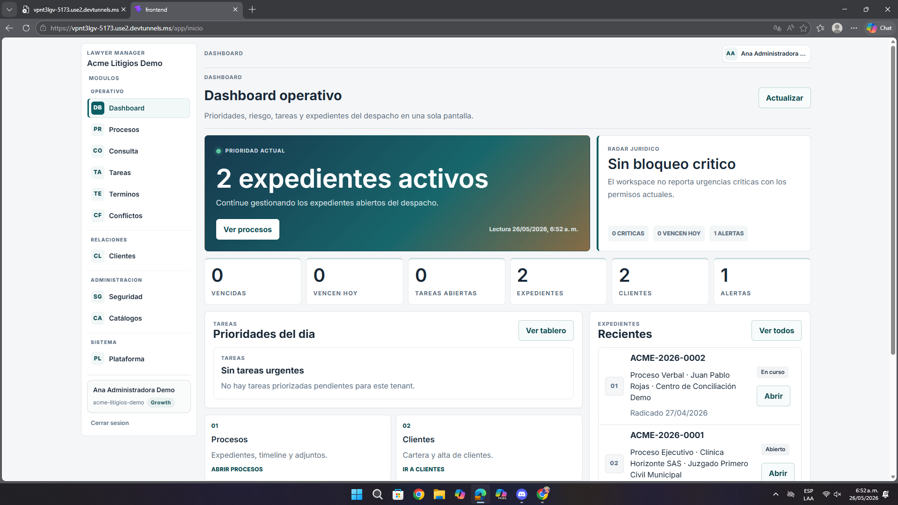

# Análisis de la Segunda Pantalla – Dashboard Operativo

**Fecha:** 26 de mayo de 2026  
**Contexto:** Revisión de UI/UX y jerarquía visual  
**URL analizada:** `https://vpnt3lgv-5173.use2.devtunnels.ms/app/inicio`  
**Archivo asociado:** `pantalla2.png`

---

## Resumen de hallazgos

La pantalla principal concentra información importante, pero hoy se percibe saturada y con poca diferenciación entre lo prioritario y lo secundario.

- Varias métricas compiten entre sí.
- La acción principal no resalta lo suficiente.
- Hay demasiados bloques con peso visual similar.

---

## 1. Problemas de UI/UX

| Observación | Impacto |
|-------------|---------|
| Muchas tarjetas y números con el mismo protagonismo visual | Cuesta identificar prioridades |
| El CTA principal se mezcla con otras acciones | El usuario no entiende rápido qué hacer primero |
| Textos secundarios tienen poco peso visual | Se pierde contexto importante |
| Varios clics potenciales tienen tamaño reducido | Menor comodidad en uso táctil |

---

## 2. Recomendaciones

- Dejar una tarjeta o bloque principal más dominante.
- Agrupar métricas secundarias en una estructura más compacta.
- Mejorar contraste y tamaño de la información de apoyo.
- Destacar mejor el flujo principal del dashboard.

---

## 3. Priorización

| Prioridad | Tipo | Acción |
|-----------|------|--------|
| **Alta** | UX | Reordenar la jerarquía visual |
| **Media** | UI | Mejorar contraste y pesos tipográficos |
| **Media** | Accesibilidad | Aumentar tamaño de targets clicables |

---

## Anexo – Evidencia visual

