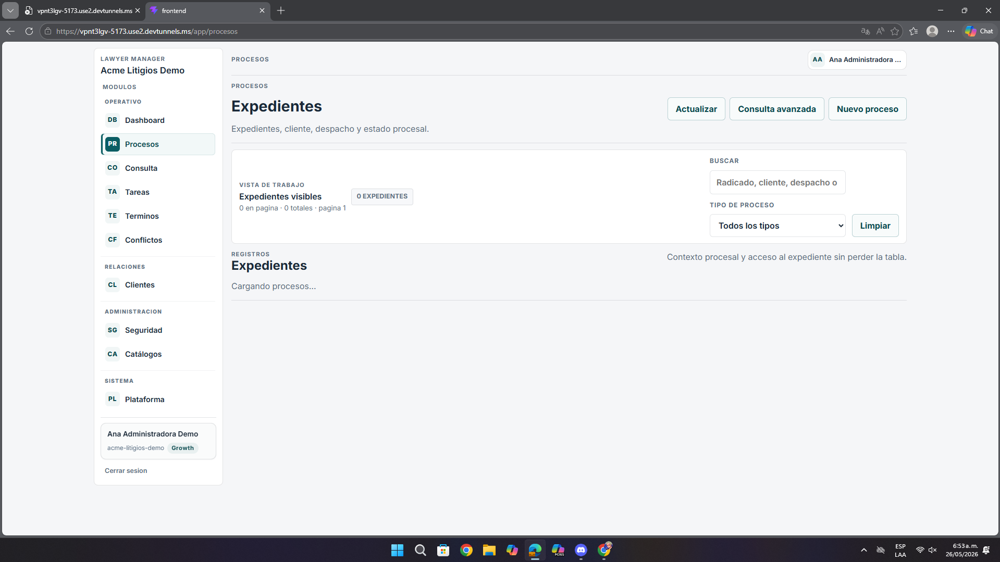
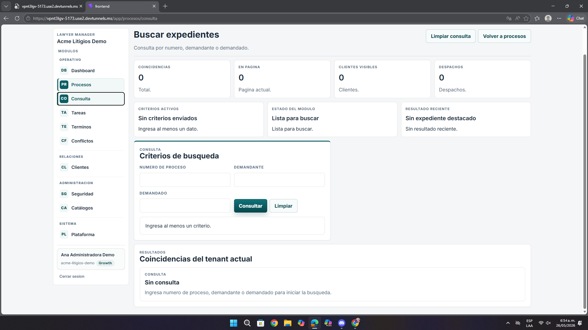
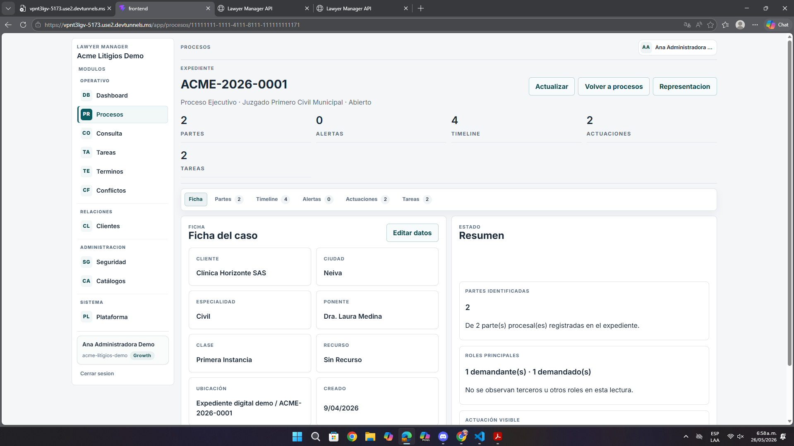

# Análisis de Pantallas – Procesos, Consulta y Ficha de Expediente

**Fecha:** 26 de mayo de 2026  
**Contexto:** Revisión de UI/UX, navegación y flujo operativo  
**URLs analizadas:**  
- `https://vpnt3lgv-5173.use2.devtunnels.ms/app/procesos`  
- `https://vpnt3lgv-5173.use2.devtunnels.ms/app/procesos/consulta`  
- Ruta interna observada del tipo `https://vpnt3lgv-5173.use2.devtunnels.ms/app/procesos/{id}`  
**Imágenes analizadas:** `pantalla3.png`, `pantalla3.1.png`, `pantalla3.2.png`

---

## Resumen ejecutivo

El flujo de expedientes cubre el caso principal del sistema, pero todavía exige demasiado esfuerzo para listar, buscar y entender un caso sin fricción.

- Los estados de carga o vacío no orientan lo suficiente.
- Los filtros y resultados no trabajan visualmente como un solo bloque.
- El detalle del expediente reúne demasiadas acciones con la misma importancia.

---

## 1. Problemas del listado de procesos

| Observación | Impacto |
|-------------|---------|
| El listado queda en “cargando” sin mayor contexto | El usuario no sabe si esperar o reintentar |
| Los filtros están separados del contenido clave | El recorrido visual se siente poco natural |
| Hay varias acciones juntas en la cabecera | Aumenta el ruido y baja la claridad |

---

## 2. Problemas de la consulta avanzada

| Observación | Impacto |
|-------------|---------|
| Los mensajes vacíos no orientan lo suficiente | La consulta puede parecer rota |
| El formulario y los KPIs vacíos ocupan mucho espacio | Se alarga la interacción sin aportar valor |
| Falta una guía más visible sobre qué criterio usar | El usuario duda cómo buscar |

---

## 3. Problemas de la ficha del expediente

| Observación | Impacto |
|-------------|---------|
| Varias acciones compiten en la parte superior | Difícil distinguir qué acción es principal |
| Las pestañas con conteos no refuerzan bien el contexto | La navegación interna pierde claridad |
| La ficha y el resumen se ven bien, pero el flujo general sigue fragmentado | Más tiempo para interpretar la información |

---

## 4. Recomendaciones

- Integrar mejor filtros, estados y resultados.
- Mejorar los estados vacíos y de carga con mensajes más claros.
- Dar una sola acción principal en el detalle del expediente.
- Reforzar el contexto activo en pestañas y navegación interna.

---

## 5. Priorización

| Prioridad | Tipo | Acción |
|-----------|------|--------|
| **Alta** | UX | Reordenar flujo de búsqueda y lectura |
| **Alta** | UI | Mejorar jerarquía de acciones en expediente |
| **Media** | Feedback | Hacer más claros los estados vacíos y de carga |

---

## Anexo – Evidencia visual

