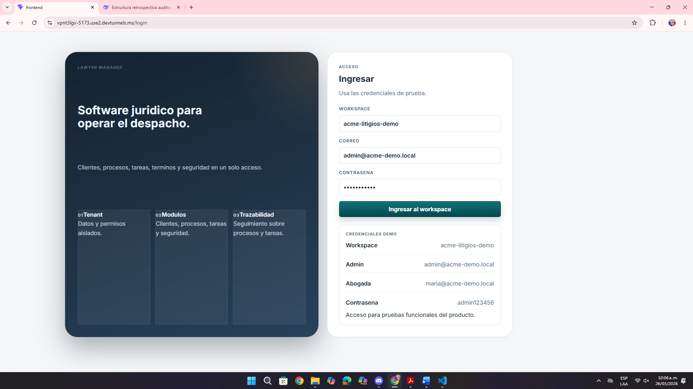

# Análisis de la Pantalla de Inicio de Sesión

**Fecha:** 26 de mayo de 2026  
**Contexto:** Revisión de UI/UX, claridad y seguridad  
**URL analizada:** `https://vpnt3lgv-5173.use2.devtunnels.ms/login`  
**Archivo asociado:** `pantalla1.png`

---

## Resumen de hallazgos

La pantalla de acceso presenta problemas visibles desde el primer contacto con el producto:

- Credenciales demo expuestas directamente en la interfaz.
- Jerarquía visual poco clara entre información de apoyo y formulario.
- Alineación y distribución mejorables en los bloques informativos.

---

## 1. Problemas principales detectados

| Observación | Impacto |
|-------------|---------|
| Las credenciales están visibles en la pantalla | Riesgo de seguridad y mala práctica incluso en demo |
| El formulario comparte espacio con demasiado contenido secundario | El usuario pierde foco en la acción principal |
| Hay poca separación visual entre elementos | La pantalla se siente menos profesional |

---

## 2. Recomendaciones

- Ocultar las credenciales del login o moverlas a una sección controlada.
- Dar más protagonismo al formulario de acceso.
- Mejorar espaciado, alineación y jerarquía visual.

---

## 3. Priorización

| Prioridad | Tipo | Acción |
|-----------|------|--------|
| **Crítica** | Seguridad | Eliminar credenciales visibles |
| **Alta** | UX | Simplificar el contenido de la pantalla |
| **Media** | UI | Ajustar espacios y alineación |

---

## Anexo – Evidencia visual

